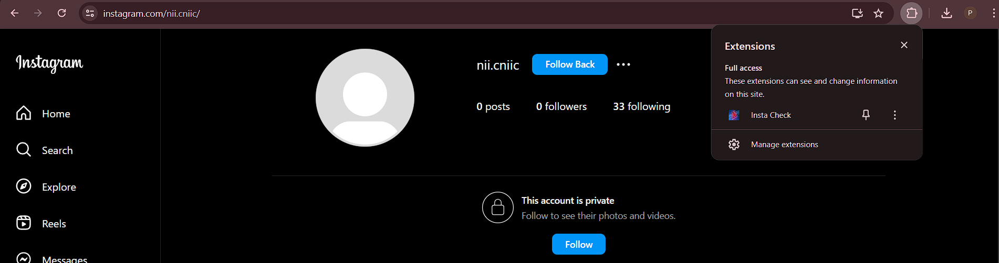
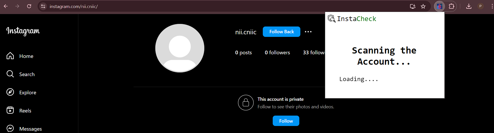
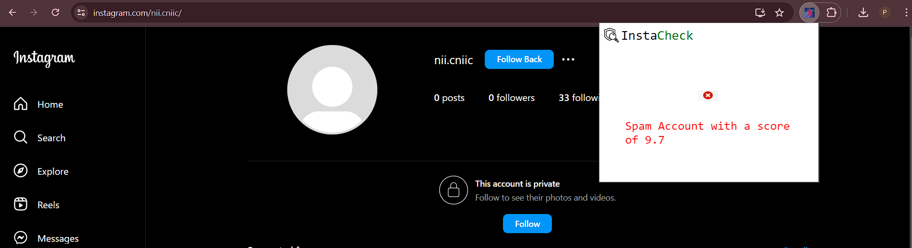
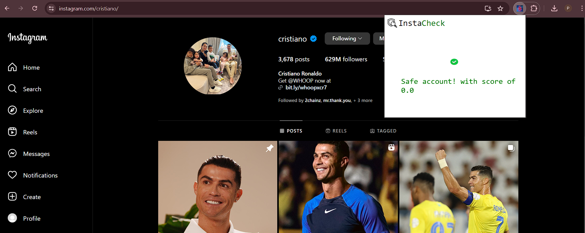

# InstaChecker

An extension to effectively detect spam accounts on Instagram and keep you safe from giving your data away voluntarily.

## Installation

Follow these steps to install and use the extension:

### Step 1: Clone the Repo or Download the Repo

Clone or download the entire repository to your local machine.

```bash
git clone <repo_url>
```

### Step 2: Install All Dependencies
Install all the required dependencies. Make sure you have Python installed foremost!
```bash
pip install tld
pip install joblib
npm install express cors axios body-parser child-process module
```
### Step 3: Run the server
Open index.js in your code viewer(preferably VS code) and run the index.js file by using the following command
```bash
node index.js
```
If you have nodemon installed you can also use 
```bash
nodemon index.js
```
inorder to dynamically observe any changes made to the code

### Step 4:Load the extension into your browser
Go to your preferred browser and navigate to settings. In settings search manage extension options and then turn on developer mode usually found on the top right corner. Then click on load or unload package and add extension folder 


<br>
### Step 5:Ensure the Server is Running
Make sure your index.js is running and listening, go to your preferred instagram user and click on extension. Run the extension.



### Step 6:Run the Extension on Instagram
The extension will issue a pop up while loading and running the model later indicating if the user is spam or not




